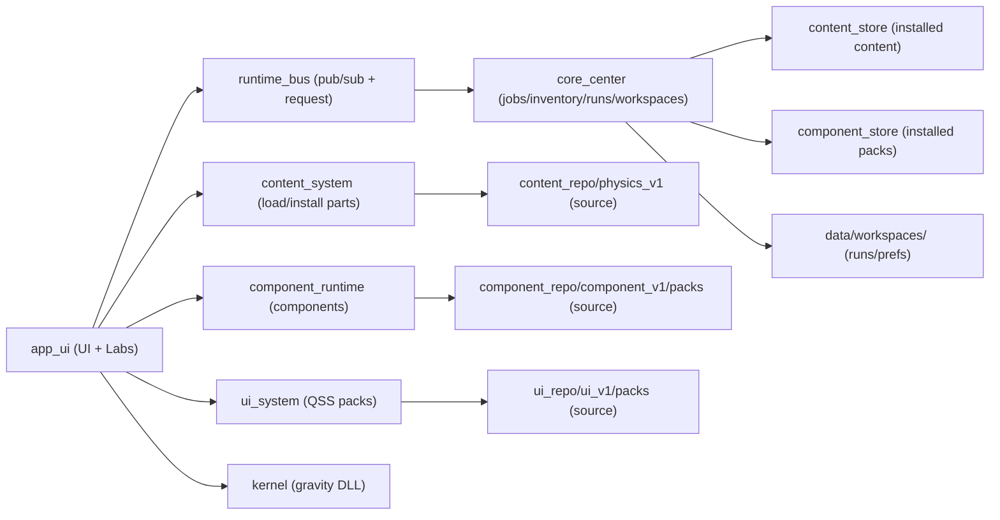
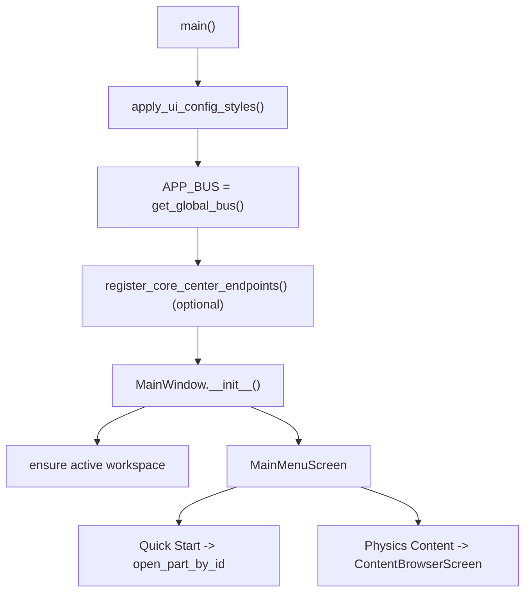
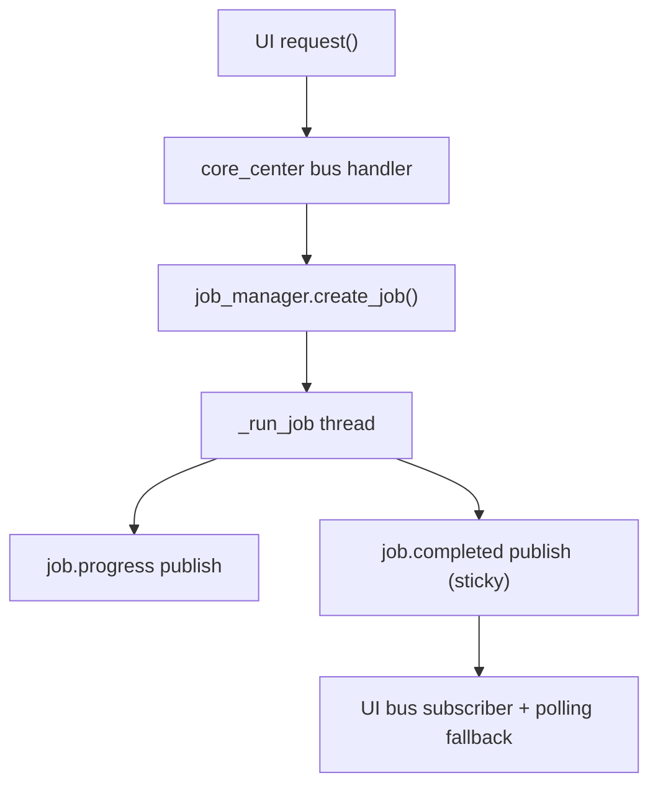
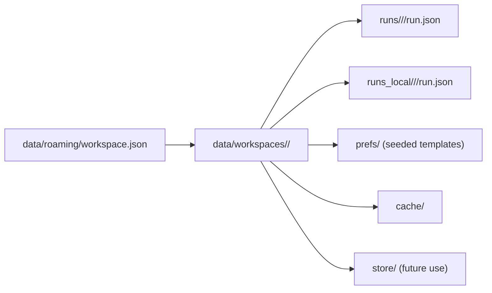

# PhysicsLab App Summary (Code-Verified Checkpoint)

## App at a glance (verified features)
- PyQt6 desktop app driven by a QStackedWidget main window with profile-gated navigation (Anchor: `app_ui/main.py:MainWindow.__init__`, `app_ui/main.py:MainMenuScreen._rebuild_buttons`).
- Quick Start selects the first READY lab part and opens it directly via `open_part_by_id`; if none are READY, routes to Content Management with an install message (Anchor: `app_ui/main.py:MainWindow._start_physics`, `app_ui/main.py:MainWindow._find_quick_start_part`, `app_ui/main.py:MainWindow.open_part_by_id`).
- Content Browser opens parts by priority: `component_id` → component runtime, then lab_id → LabHost, else markdown viewer (Anchor: `app_ui/main.py:ContentBrowserScreen._open_selected`, `app_ui/main.py:MainWindow.open_part_by_id`).
- Registered labs: gravity, projectile, electric_field, lens_ray, vector_add (Anchor: `app_ui/labs/registry.py:list_labs`).
- LabHost wraps lab widgets with guide panel, export menu (policy-gated), Grid/Axes toggles, telemetry (Explorer + policy), and run context injection (Anchor: `app_ui/labs/host.py:LabHost`).
- Workspaces are first-class: active workspace is created/selected on boot and drives run locations under `data/workspaces/<id>/runs` (Anchor: `core_center/workspace_manager.py:get_active_workspace`, `core_center/storage_manager.py:_runs_root`, `app_ui/main.py:MainWindow._ensure_workspace_context`).
- System Health is segmented into Overview / Runs / Maintenance / Modules / Jobs and drives Core Center via the runtime bus (Anchor: `app_ui/main.py:SystemHealthScreen`).
- Component runtime supports builtin components + pack-defined components, and UI exposes Component Management + Component Sandbox (Explorer) (Anchor: `component_runtime/registry.py`, `component_runtime/packs.py`, `app_ui/main.py:ComponentManagementScreen`, `app_ui/main.py:ComponentSandboxScreen`).
- Core Center (Management Core) is optional; UI imports are guarded and runtime bus endpoints are registered if available (Anchor: `app_ui/main.py:CORE_CENTER_AVAILABLE`, `app_ui/main.py:CORE_CENTER_BUS_ENDPOINTS`).
- Runtime bus is local, in-process pub/sub + request/reply with sticky topics and optional debug logging (Anchor: `runtime_bus/bus.py:RuntimeBus`, `runtime_bus/bus.py:BUS_DEBUG`).

## High-level architecture (modules + boundaries)
- `app_ui/`: UI orchestration, screens, labs, and component host integration (entry: `python -m app_ui.main`) (Anchor: `app_ui/main.py:main`).
- `content_system/`: content hierarchy loader + part installer (Anchor: `content_system/loader.py:list_tree`, `content_system/loader.py:download_part`).
- `runtime_bus/`: in-process bus types and topics (Anchor: `runtime_bus/bus.py`, `runtime_bus/messages.py`, `runtime_bus/topics.py`).
- `core_center/`: optional Management Core for discovery/registry/inventory/jobs/storage/policy/workspaces (Anchor: `core_center/bus_endpoints.py:register_core_center_endpoints`).
- `component_runtime/`: component registry, host, packs, builtins (Anchor: `component_runtime/registry.py`, `component_runtime/host.py`).
- `content_repo/physics_v1/`: canonical content pack; `content_store/physics_v1/` is the installed mirror (Anchor: `content_system/loader.py:REPO_BASE`, `content_system/loader.py:STORE_BASE`).
- `component_repo/component_v1/packs/` + `component_store/component_v1/packs/`: component pack source + installed mirror (Anchor: `component_runtime/packs.py:REPO_ROOT`, `component_runtime/packs.py:STORE_ROOT`).
- `ui_system/` + `ui_repo/` + `ui_store/`: UI pack manager and QSS packs (Anchor: `ui_system/manager.py:list_packs`).
- `workspace_repo/templates/`: workspace template seeds (Anchor: `core_center/workspace_manager.py:TEMPLATES_ROOT`).
- `kernel/`: Rust DLL for gravity kernel, bridged in Python (Anchor: `app_ui/kernel_bridge.py`).

### Diagram: subsystem map (code-verified)

## Startup + navigation flow
- Entry: `app_ui/main.py:main` creates QApplication, applies UI pack, constructs MainWindow, and starts the event loop (Anchor: `app_ui/main.py:main`, `app_ui/main.py:apply_ui_config_styles`).
- Global runtime bus is created by `get_global_bus()` and Core Center endpoints are registered when available (Anchor: `runtime_bus/bus.py:get_global_bus`, `app_ui/main.py:APP_BUS`, `app_ui/main.py:CORE_CENTER_BUS_ENDPOINTS`).
- MainWindow wires screens into a QStackedWidget and resolves an active workspace on boot (Anchor: `app_ui/main.py:MainWindow.__init__`, `app_ui/main.py:MainWindow._ensure_workspace_context`).
- Quick Start uses `ContentSystemAdapter.list_tree()` to find the first READY lab part and opens it directly via `open_part_by_id` (Anchor: `app_ui/main.py:MainWindow._find_quick_start_part`, `app_ui/main.py:MainWindow.open_part_by_id`).
- Physics Content always opens ContentBrowserScreen (Anchor: `app_ui/main.py:MainWindow._open_content_browser`).

### Diagram: boot + routing (code-verified)

## Screens and what each one does
- MainMenuScreen: Home buttons with profile gating (Anchor: `app_ui/main.py:MainMenuScreen._rebuild_buttons`).
- ContentBrowserScreen: tree view, install part, open component/lab/markdown based on part metadata (Anchor: `app_ui/main.py:ContentBrowserScreen.refresh_tree`, `app_ui/main.py:ContentBrowserScreen._open_selected`).
- SystemHealthScreen (segmented): Overview report, Runs manager (list/delete/prune), Maintenance cleanup, Modules install/uninstall (Explorer), Jobs history (Explorer) (Anchor: `app_ui/main.py:SystemHealthScreen`, `app_ui/main.py:SystemHealthScreen._refresh_runs_list`).
- WorkspaceManagementScreen (Explorer): list/create/switch/delete workspaces with templates (Anchor: `app_ui/main.py:WorkspaceManagementScreen`).
- ModuleManagementScreen: registry table and module install/uninstall via bus (Anchor: `app_ui/main.py:ModuleManagementScreen._refresh_registry`, `app_ui/main.py:ModuleManagementScreen._start_job`).
- ContentManagementScreen: filterable tree, status pill, module actions, double-click opens part in browser (Anchor: `app_ui/main.py:ContentManagementScreen._apply_filter`, `app_ui/main.py:ContentManagementScreen._on_item_double_clicked`, `app_ui/main.py:StatusPill`).
- ComponentManagementScreen (Explorer): component pack install/uninstall (Anchor: `app_ui/main.py:ComponentManagementScreen._run_job`).
- ComponentSandboxScreen (Explorer): opens registered components + labhost components + pack components (Anchor: `app_ui/main.py:ComponentSandboxScreen.refresh_components`).
- ComponentHostScreen: component viewer with close/back controls (Anchor: `app_ui/main.py:ComponentHostScreen.open_component`).
- SettingsDialog: UI pack selection, reduced motion, experience profile (Anchor: `app_ui/main.py:SettingsDialog._save_settings`).
- ModuleManagerScreen exists but is not wired into MainWindow navigation (Anchor: `app_ui/main.py:ModuleManagerScreen`, `app_ui/main.py:MainWindow.__init__`).

## Content system (install + browse + status model)
- Hierarchy built from `content_repo/physics_v1` and `content_store/physics_v1` (Anchor: `content_system/loader.py:list_tree`).
- Status model: READY / NOT_INSTALLED / UNAVAILABLE (Anchor: `content_system/loader.py:STATUS_READY`, `content_system/loader.py:STATUS_NOT_INSTALLED`, `content_system/loader.py:STATUS_UNAVAILABLE`).
- READY requires store manifest + all referenced assets in content_store (Anchor: `content_system/loader.py:_compute_part_status`, `content_system/loader.py:_collect_asset_paths`).
- Lab metadata comes from `x_extensions.lab.lab_id` and is surfaced as `part["lab"]` (Anchor: `content_system/loader.py:_extract_lab_metadata`, `content_system/loader.py:get_part`).
- Component metadata uses a top-level `component_id` on part manifests and is surfaced as `part["component_id"]` (Anchor: `content_system/loader.py:_extract_component_id`, `content_system/loader.py:get_part`).
- `download_part()` copies part directory and referenced assets from repo to store (Anchor: `content_system/loader.py:download_part`).
- ContentSystemAdapter in UI wraps content_system calls and converts exceptions into status records (Anchor: `app_ui/main.py:ContentSystemAdapter`).

## Labs system (plugins + LabHost + context)
- LabPlugin contract and optional export/telemetry hooks (Anchor: `app_ui/labs/base.py:LabPlugin`).
- Registered labs: gravity, projectile, electric_field, lens_ray, vector_add (Anchor: `app_ui/labs/registry.py`).
- LabHost provisions policy/run context, guides, export actions, telemetry, workspace info, and user prefs (Anchor: `app_ui/labs/host.py:LabHost`).
- LabContext + per-lab Grid/Axes prefs stored in `data/roaming/lab_prefs.json` (Anchor: `app_ui/labs/context.py:LabContext`, `app_ui/labs/prefs_store.py:PREFS_PATH`).
- LabHost injects context via `set_context`, `set_lab_context`, or attribute fallback (Anchor: `app_ui/labs/host.py:_apply_lab_context`).
- Guides use `x_extensions.guides` keyed by profile, with store-first asset resolution (Anchor: `app_ui/main.py:MainWindow._load_lab_guide_text`, `app_ui/main.py:read_asset_text`).
- Gravity lab uses kernel backend with Python fallback (Anchor: `app_ui/labs/gravity_lab.py:KernelGravityBackend`, `app_ui/labs/gravity_lab.py:PythonGravityBackend`).
- Projectile lab is pure-Python QPainter simulation (Anchor: `app_ui/labs/projectile_lab.py:ProjectileLabWidget`, `app_ui/labs/projectile_lab.py:ProjectileCanvas`).
- Electric Field / Lens Ray / Vector Add use RenderCanvas with layered painters and shared helpers (Anchor: `app_ui/labs/renderkit/canvas.py:RenderCanvas`, `app_ui/labs/electric_field_lab.py`, `app_ui/labs/lens_ray_lab.py`, `app_ui/labs/vector_add_lab.py`).
- Vector Add uses the subcomponent GridAxesRenderable for grid/axes drawing (Anchor: `component_runtime/subcomponents/render_grid_axes.py:GridAxesRenderable`, `app_ui/labs/vector_add_lab.py`).

## Rendering helpers (shared library)
- Vec2 math helpers (Anchor: `app_ui/labs/shared/math2d.py:Vec2`).
- World<->screen transforms (Anchor: `app_ui/labs/shared/viewport.py:ViewTransform`).
- QPainter primitives for grid/axes/vectors (Anchor: `app_ui/labs/shared/primitives.py:draw_grid`, `app_ui/labs/shared/primitives.py:draw_axes`, `app_ui/labs/shared/primitives.py:draw_vector`).
- RenderCanvas provides a layer-driven paint surface and its own transform cache (Anchor: `app_ui/labs/renderkit/canvas.py:RenderCanvas`).

## Runtime bus (topics + flows)
- In-process bus with publish/subscribe/request, sticky topics, and debug output via `PHYSICSLAB_BUS_DEBUG=1` (Anchor: `runtime_bus/bus.py:RuntimeBus.publish`, `runtime_bus/bus.py:RuntimeBus.subscribe`, `runtime_bus/bus.py:BUS_DEBUG`).
- Message envelope schema (Anchor: `runtime_bus/messages.py:MessageEnvelope`).
- Topic constants (Anchor: `runtime_bus/topics.py`).
- Global bus instance via `get_global_bus()` (Anchor: `runtime_bus/bus.py:get_global_bus`, `app_ui/main.py:APP_BUS`).
- UI registers a runtime bus diagnostics handler for `runtime.bus.report.request` (Anchor: `app_ui/main.py:_handle_bus_comm_report`, `runtime_bus/topics.py:RUNTIME_BUS_REPORT_REQUEST`).
- UI relies on request/reply to Core Center for reports, inventory, jobs, runs, and workspaces (Anchor: `app_ui/main.py:SystemHealthScreen._refresh_report`, `app_ui/main.py:SystemHealthScreen._refresh_runs_list`, `app_ui/main.py:ModuleManagementScreen._start_job`, `app_ui/main.py:ContentManagementScreen._start_module_job`, `app_ui/main.py:ComponentManagementScreen._run_job`, `app_ui/main.py:WorkspaceManagementScreen._load_workspaces`).

### Diagram: job lifecycle (code-verified)

## Core Center (optional; bus endpoints + jobs)
- Optional import in UI; endpoints registered when available (Anchor: `app_ui/main.py:CORE_CENTER_BUS_ENDPOINTS`, `core_center/bus_endpoints.py:register_core_center_endpoints`).
- Discovery scans content_repo/content_store/ui_repo/ui_store plus lab registry (Anchor: `core_center/discovery.py:discover_components`).
- Registry saved to `data/roaming/registry.json` (Anchor: `core_center/registry.py:save_registry`).
- Jobs run in background threads and record history in `data/roaming/jobs.json` (Anchor: `core_center/job_manager.py:create_job`, `core_center/job_manager.py:JOB_HISTORY_PATH`).
- Storage report includes runs footprint (Anchor: `core_center/storage_report.py:generate_report`, `core_center/storage_manager.py:summarize_runs`).
- Policy defaults + overrides (Anchor: `core_center/policy_manager.py:DEFAULT_POLICY`, `core_center/policy_manager.py:resolve_policy`).
- Run directories allocated in the active workspace: `data/workspaces/<id>/runs/<lab>/<run>` with retention (Anchor: `core_center/storage_manager.py:allocate_run_dir`, `core_center/storage_manager.py:_runs_root`).
- Runs inventory aggregates `runs` + `runs_local` within the active workspace (Anchor: `core_center/storage_manager.py:list_runs_inventory`).
- Inventory endpoint returns installed modules, component packs, and UI packs (Anchor: `core_center/inventory.py:get_inventory_snapshot`).
- Workspace endpoints support list/create/set/delete + templates list (Anchor: `core_center/bus_endpoints.py:_handle_workspace_list`, `core_center/bus_endpoints.py:_handle_workspace_create`).
- Endpoints: report, cleanup, policy, registry, run_dir allocation, runs list/delete/prune, module install/uninstall, component pack install/uninstall, jobs list/get, inventory (Anchor: `core_center/bus_endpoints.py:register_core_center_endpoints`).
- Sticky topics for report/cleanup are emitted via `_StickyBusProxy` (Anchor: `core_center/bus_endpoints.py:_StickyBusProxy`).
- Job completion uses sticky `job.completed`, with timeouts enforcing terminal state (Anchor: `core_center/job_manager.py:_run_job`, `core_center/job_manager.py:_watch_job_timeout`).
- UI includes polling fallbacks for job terminal state (Module/Content/Component Management) using `core.jobs.get` (Anchor: `app_ui/main.py:ModuleManagementScreen._poll_job_status`, `app_ui/main.py:ContentManagementScreen._poll_job_status`, `app_ui/main.py:ComponentManagementScreen._poll_job_status`).

## UI packs and theming
- Startup applies UI pack via `apply_ui_config_styles` and `ui_system.manager` (Anchor: `app_ui/main.py:apply_ui_config_styles`, `ui_system/manager.py:resolve_pack`).
- Settings dialog updates `data/roaming/ui_config.json` and re-applies the QSS (Anchor: `app_ui/main.py:SettingsDialog._save_settings`, `app_ui/config.py:save_ui_config`).
- Reduced motion is stored in ui_config and read by labs/LabHost (Anchor: `app_ui/config.py:get_reduced_motion`, `app_ui/labs/host.py:LabHost`, `app_ui/labs/*_lab.py:set_reduced_motion`).

## Data layout (runtime state + content)
- UI config: `data/roaming/ui_config.json` (Anchor: `app_ui/config.py:CONFIG_PATH`, `ui_system/manager.py:CONFIG_PATH`).
- Experience profile: `data/roaming/experience_profile.json` (Anchor: `app_ui/config.py:PROFILE_PATH`).
- Policy overrides: `data/roaming/policy.json` (Anchor: `core_center/policy_manager.py:_policy_path`).
- Registry: `data/roaming/registry.json` (Anchor: `core_center/registry.py:save_registry`).
- Job history: `data/roaming/jobs.json` (Anchor: `core_center/job_manager.py:JOB_HISTORY_PATH`).
- Lab prefs: `data/roaming/lab_prefs.json` (Anchor: `app_ui/labs/prefs_store.py:PREFS_PATH`).
- Active workspace selector: `data/roaming/workspace.json` (Anchor: `core_center/workspace_manager.py:_active_path`).
- Workspace roots: `data/workspaces/<id>/{runs,runs_local,cache,store,prefs}` (Anchor: `core_center/workspace_manager.py:_ensure_workspace_dirs`).
- Workspace prefs seeds (if template applied): `data/workspaces/<id>/prefs/{workspace_config.json,lab_prefs.json,policy_overrides.json,pins.json}` (Anchor: `core_center/workspace_manager.py:TEMPLATE_SEED_FILES`).
- Core run dirs: `data/workspaces/<id>/runs/<lab>/<run>/run.json` (Anchor: `core_center/storage_manager.py:allocate_run_dir`).
- Local fallback runs: `data/workspaces/<id>/runs_local/<lab>/<run>/run.json` (Anchor: `app_ui/labs/host.py:_create_local_run_dir`).
- Content repo/store roots: `content_repo/physics_v1`, `content_store/physics_v1` (Anchor: `content_system/loader.py:REPO_BASE`, `content_system/loader.py:STORE_BASE`).
- UI pack roots: `ui_repo/ui_v1`, `ui_store/ui_v1` (Anchor: `ui_system/manager.py:list_packs`).
- Component pack roots: `component_repo/component_v1/packs`, `component_store/component_v1/packs` (Anchor: `component_runtime/packs.py:REPO_ROOT`, `component_runtime/packs.py:STORE_ROOT`).
- Workspace templates: `workspace_repo/templates/<template_id>/` (Anchor: `core_center/workspace_manager.py:TEMPLATES_ROOT`).

### Diagram: workspace + runs layout (code-verified)

## Extension recipes (anchored)
- Add a lab:
  1) Create `app_ui/labs/<lab>.py` implementing LabPlugin (Anchor: `app_ui/labs/base.py:LabPlugin`).
  2) Register in `app_ui/labs/registry.py`.
  3) Add a part manifest with `x_extensions.lab.lab_id` and guides (Anchor: `content_system/loader.py:_extract_lab_metadata`, `app_ui/main.py:MainWindow._load_lab_guide_text`).
- Add a content part:
  1) Add/modify content_repo manifests (Anchor: `content_repo/physics_v1/module_manifest.json`, `content_repo/physics_v1/sections/**/package_manifest.json`).
  2) Install via `content_system.download_part()` or module install job (Anchor: `content_system/loader.py:download_part`, `core_center/job_manager.py:_handle_module_install`).
- Add a UI pack:
  1) Create `ui_repo/ui_v1/packs/<id>/ui_pack_manifest.json` + QSS files (Anchor: `ui_system/manager.py:_load_manifest`).
  2) Set `data/roaming/ui_config.json` or use Settings dialog (Anchor: `app_ui/main.py:SettingsDialog._save_settings`).
- Add a component pack (asset/config only):
  1) Create `component_repo/component_v1/packs/<id>/component_pack_manifest.json` + assets (Anchor: `component_runtime/packs.py:_list_packs`).
  2) Use built-in impls (`builtin:markdown_panel`, `builtin:lab_preset`) (Anchor: `component_runtime/registry.py:register_pack_components`).
  3) Install via Core Center job endpoint (Anchor: `core_center/bus_endpoints.py:_handle_component_pack_install`).
- Add a workspace template:
  1) Create `workspace_repo/templates/<template_id>/template.json` and optional seed files (`workspace_config.json`, `lab_prefs.json`, `policy_overrides.json`, `pins.json`) (Anchor: `core_center/workspace_manager.py:TEMPLATE_SEED_FILES`).
  2) Templates are listed via `core.workspace.templates.list.request` (Anchor: `core_center/bus_endpoints.py:_handle_workspace_templates`).
- Add a Core Center endpoint:
  1) Add topic constant (Anchor: `runtime_bus/topics.py`).
  2) Register handler in `core_center/bus_endpoints.py`.
  3) Call via `RuntimeBus.request(...)` in UI (Anchor: `runtime_bus/bus.py:RuntimeBus.request`).

## Current limitations / TODOs (verified)
- ModuleManagerScreen exists but is not routed in the main navigation (Anchor: `app_ui/main.py:ModuleManagerScreen`, `app_ui/main.py:MainWindow.__init__`).
- Content loader is hard-wired to `physics_v1` roots (Anchor: `content_system/loader.py:REPO_BASE`, `content_system/loader.py:STORE_BASE`).
- Content loader does not validate JSON against schemas (Anchor: `content_system/loader.py:_load_json`).
- `schemas/part_manifest.schema.json` contains duplicate `allOf` keys (Anchor: `schemas/part_manifest.schema.json`).
- `core_center/storage_report.py` has unreachable code after a `return` in `report_text` (Anchor: `core_center/storage_report.py:report_text`).
- Workspace templates are seeded into `data/workspaces/<id>/prefs/`, but runtime policy + lab prefs still read from `data/roaming` (Anchor: `core_center/workspace_manager.py:_apply_template`, `core_center/policy_manager.py:_policy_path`, `app_ui/labs/prefs_store.py:PREFS_PATH`).
- Lab prefs are global (not workspace-scoped) (Anchor: `app_ui/labs/prefs_store.py:PREFS_PATH`).
- RenderCanvas uses its own transform cache; shared ViewTransform is used by labs but not enforced globally (Anchor: `app_ui/labs/renderkit/canvas.py:RenderCanvas`, `app_ui/labs/shared/viewport.py:ViewTransform`).
- `content_store/physics_v1/assets/lab_viz/` is not present in the repo tree (direct repo reference: `content_store/physics_v1/assets/lab_viz`).
- `_viz_canvas.py` exists but is not referenced by current lab code (Anchor: `app_ui/labs/_viz_canvas.py`, `rg -n \"_viz_canvas\" app_ui/labs` -> none).
- Component packs support only builtin implementations; no arbitrary code loading (Anchor: `component_runtime/registry.py:register_pack_components`).

## Milestones and versioning
- Versioning convention used in commit messages:
  - V<major>.<minor> is used for changes, improvements, and additions.
  - V<major>.<minor>.<patch> is used for fixes and refactors.
  Anchor: `git log --oneline -n 60` (see Verification Appendix).

## Delta vs previous checkpoint
- Added: Workspace Management screen, workspace templates, and workspace-backed run roots (Anchor: `app_ui/main.py:WorkspaceManagementScreen`, `core_center/workspace_manager.py:get_active_workspace`, `core_center/storage_manager.py:_runs_root`).
- Added: Runs manager in System Health (list/delete/prune + bulk actions) (Anchor: `app_ui/main.py:SystemHealthScreen._refresh_runs_list`, `core_center/storage_manager.py:list_runs_inventory`).
- Added: Component runtime + component packs with Component Management and Sandbox (Anchor: `component_runtime/registry.py`, `component_runtime/packs.py`, `app_ui/main.py:ComponentManagementScreen`, `app_ui/main.py:ComponentSandboxScreen`).
- Modified: Core Center job manager now enforces timeouts and publishes sticky job completion (Anchor: `core_center/job_manager.py:_watch_job_timeout`, `core_center/job_manager.py:_run_job`).
- Modified: Content parts can open components via `component_id` (Anchor: `content_system/loader.py:_extract_component_id`, `app_ui/main.py:ContentBrowserScreen._open_selected`).

## Legacy / Needs manual re-verify
- ModuleManagerScreen behavior is not reachable through current navigation; if you intend to use it, wire it into MainWindow and re-verify its UI flow (Anchor: `app_ui/main.py:ModuleManagerScreen`).
- Sprite-based lab visuals referenced in `content_repo/physics_v1/assets/lab_viz` are not used by current lab code; manual verification required if these assets are reintroduced (Anchor: `content_repo/physics_v1/assets/lab_viz`, `app_ui/labs/renderkit/primitives.py`).
- Runtime bus diagnostics endpoint is registered, but no UI exposes it; manual verification required if you add a UI hook (Anchor: `app_ui/main.py:_handle_bus_comm_report`).
- Workspace template seed files are copied into workspace prefs, but runtime consumption is not implemented; manual verification required if you wire templates into policy/prefs later (Anchor: `core_center/workspace_manager.py:_apply_template`).

## What to read next (file pointers)
- Entry + routing: `app_ui/main.py`
- Labs contract + host: `app_ui/labs/base.py`, `app_ui/labs/host.py`
- Lab visuals: `app_ui/labs/shared/*`, `app_ui/labs/renderkit/canvas.py`, `app_ui/labs/renderkit/primitives.py`
- Content loader: `content_system/loader.py`
- Bus core: `runtime_bus/bus.py`, `runtime_bus/topics.py`
- Core Center endpoints/jobs: `core_center/bus_endpoints.py`, `core_center/job_manager.py`
- Core storage/policy/workspaces: `core_center/storage_manager.py`, `core_center/storage_report.py`, `core_center/policy_manager.py`, `core_center/workspace_manager.py`
- Content manifests: `content_repo/physics_v1/module_manifest.json`, `content_repo/physics_v1/sections/**/package_manifest.json`
- UI packs: `ui_system/manager.py`, `ui_repo/ui_v1/packs/*/ui_pack_manifest.json`
- Component packs: `component_runtime/packs.py`, `component_repo/component_v1/packs/*/component_pack_manifest.json`

# Detailed Addendum (Checkpoint-ready)

## A) Kernel bridge and fallbacks (explained)

### What it does
The kernel bridge (`app_ui/kernel_bridge.py`) loads the Rust DLL and exposes a Python session API for the gravity simulation. The Gravity Lab uses the kernel if available; otherwise it falls back to a Python backend and reports the fallback in the UI (Anchor: `app_ui/kernel_bridge.py:GravityKernelSession`, `app_ui/labs/gravity_lab.py:GravityLabWidget._init_backend`).

ModuleManagerScreen includes a gravity-demo run preview that uses the kernel bridge, but this screen is not routed from MainWindow navigation (Anchor: `app_ui/main.py:ModuleManagerScreen._run_selected_part`, `app_ui/main.py:MainWindow.__init__`).

### Exact load sequence (ordered)
- `create_gravity_session()` -> `GravityKernelSession.__init__()` -> `_get_lib()` -> `_resolve_symbols()` -> `_load_library()` (Anchor: `app_ui/kernel_bridge.py`).
- `_load_library()` tries DLLs in order:
  1) `kernel/target/release/physicslab_kernel.dll`
  2) `app_ui/native/physicslab_kernel.dll` (Anchor: `app_ui/kernel_bridge.py:DLL_CANDIDATES`).
- When loaded, ctypes binds `pl_world_create`, `pl_world_destroy`, `pl_world_step`, `pl_world_get_state`, `pl_last_error_code`, `pl_last_error_message` (Anchor: `app_ui/kernel_bridge.py:_resolve_symbols`).

### User-visible behavior
- Gravity Lab shows `Backend: kernel` or `Backend: python-fallback` based on initialization success (Anchor: `app_ui/labs/gravity_lab.py:GravityLabWidget._init_backend`).
- If a kernel call fails during simulation, Gravity Lab shows a warning dialog and pauses (Anchor: `app_ui/labs/gravity_lab.py:GravityLabWidget._tick`).
- ModuleManagerScreen disables Run unless the kernel is available (Anchor: `app_ui/main.py:ModuleManagerScreen._show_part`).

### Failure modes and symptoms
- Missing DLL triggers `KernelNotAvailable` and switches Gravity Lab to Python backend (Anchor: `app_ui/kernel_bridge.py:KernelNotAvailable`, `app_ui/labs/gravity_lab.py:GravityLabWidget._init_backend`).
- Kernel status error raises RuntimeError with the kernel message (Anchor: `app_ui/kernel_bridge.py:_fetch_error`, `app_ui/labs/gravity_lab.py:GravityLabWidget._tick`).

### Manual UI verification required
- Verify the gravity demo run preview in ModuleManagerScreen if it is wired into navigation.

## B) UI packs and theming lifecycle (explained)

### Startup apply flow
1) `main()` calls `apply_ui_config_styles(app)`.
2) `apply_ui_config_styles()` loads config via `ui_config.load_ui_config()`.
3) `ui_system.manager.ensure_config()` ensures config exists.
4) `resolve_pack()` prefers store root, then repo root.
5) QSS is applied via `manager.apply_qss()` and `_ensure_safe_font()` (Anchor: `app_ui/main.py:apply_ui_config_styles`, `ui_system/manager.py`).

### Runtime switching flow (Settings)
- `SettingsDialog._save_settings` updates ui_config and re-applies the theme immediately (Anchor: `app_ui/main.py:SettingsDialog._save_settings`).

### Reduced motion usage
- `get_reduced_motion()` reads ui_config and labs/LabHost use the flag to adjust timers/behavior (Anchor: `app_ui/config.py:get_reduced_motion`, `app_ui/labs/host.py:LabHost`, `app_ui/labs/*_lab.py:set_reduced_motion`).

### Note about supports_reduced_motion
- `supports_reduced_motion` is parsed in `ui_system/manager.py` but not enforced during apply (Anchor: `ui_system/manager.py:_load_manifest`, `app_ui/main.py:apply_ui_config_styles`).

## C) Navigation mental model (explained)

### Home button mapping
- Quick Start -> `MainWindow._start_physics()` -> `MainWindow._find_quick_start_part()` -> `MainWindow.open_part_by_id()`.
- Physics Content -> `MainWindow._open_content_browser()`.
- Module Management -> `MainWindow._open_module_management()`.
- Content Management -> `MainWindow._open_content_management()`.
- System Health / Storage -> `MainWindow._open_diagnostics()`.
- Workspace Management (Explorer) -> `MainWindow._open_workspace_management()`.
- Component Management (Explorer) -> `MainWindow._open_component_management()`.
- Component Sandbox (Explorer) -> `MainWindow._open_component_sandbox()`.
- Settings -> `MainWindow._open_settings()`.

### Quick Start selection rules
- Selects first READY part with lab_id or part_id ending `_demo` (Anchor: `app_ui/main.py:MainWindow._find_quick_start_part`).

### Back behavior
- Screen Back buttons return to MainMenuScreen.
- Lab Back returns to ContentBrowserScreen.
- Esc triggers a back action when not inside a lab, modal dialog, or text input (Anchor: `app_ui/main.py:MainWindow._handle_escape_back`).

### Manual UI verification required
- Confirm back navigation flows for each screen (Main Menu, Content Browser, System Health, Content Management, Workspace Management).

## D) Asset pipeline and RenderKit resolution (explained)

### Repo vs Store assets and READY status
- READY status requires assets in `content_store/physics_v1` (Anchor: `content_system/loader.py:_compute_part_status`).
- Text assets are resolved by `read_asset_text()` with store-first fallback to repo (Anchor: `app_ui/main.py:read_asset_text`).

### AssetResolver root choice
- `AssetResolver.from_detail()` uses `detail.paths.store_manifest` or defaults to `content_store/physics_v1` (Anchor: `app_ui/labs/renderkit/assets.py:AssetResolver.from_detail`).
- `AssetResolver.resolve()` enforces store-root containment and strips optional leading module folder (Anchor: `app_ui/labs/renderkit/assets.py:AssetResolver.resolve`).

### Caching behavior
- `AssetCache` caches SVG renderers and pixmaps keyed by path/size/tint/DPI bucket (Anchor: `app_ui/labs/renderkit/assets.py:AssetCache`).

### Missing-asset behavior
- `read_asset_text()` returns None if asset missing; Content Browser shows a warning (Anchor: `app_ui/main.py:ContentBrowserScreen._open_selected`).
- RenderKit sprite helpers return False when missing; arrow sprite has a line fallback if invoked (Anchor: `app_ui/labs/renderkit/primitives.py:draw_arrow_sprite`).
- Current lab code does not call RenderKit sprite helpers; labs use shared primitives (Anchor: `app_ui/labs/electric_field_lab.py`, `app_ui/labs/lens_ray_lab.py`, `app_ui/labs/vector_add_lab.py`).

# Fact Sheet Addendum (Ground Truth Only)

## A) Kernel bridge and fallbacks (FACTS ONLY)

Key files:
- `app_ui/kernel_bridge.py`: `DLL_CANDIDATES`, `_load_library`, `_resolve_symbols`, `_get_lib`, `_fetch_error`, `GravityKernelSession`, `create_gravity_session`, `run_gravity_demo`, `KernelNotAvailable`.
- `app_ui/labs/gravity_lab.py`: `KernelGravityBackend`, `PythonGravityBackend`, `GravityLabWidget._init_backend`, `GravityLabWidget._tick`.
- `app_ui/main.py`: `ModuleManagerScreen._show_part`, `ModuleManagerScreen._run_selected_part` (note: ModuleManagerScreen is not routed).

Load sequence:
1) `create_gravity_session()` -> `GravityKernelSession.__init__()` -> `_get_lib()` -> `_resolve_symbols()` -> `_load_library()`.
2) `_load_library()` checks DLL candidates in order (see `DLL_CANDIDATES`).
3) `_resolve_symbols()` binds `pl_world_create`, `pl_world_destroy`, `pl_world_step`, `pl_world_get_state`, `pl_last_error_code`, `pl_last_error_message`.

Fallback behavior:
- Missing DLL raises `KernelNotAvailable`; GravityLabWidget falls back to Python backend and prints `Simulation fallback: ...`.
- Kernel errors during stepping show a warning and stop the timer (`GravityLabWidget._tick`).

## B) UI packs and theming lifecycle (FACTS ONLY)

Key files:
- `ui_system/manager.py`: `Pack`, `list_packs`, `resolve_pack`, `load_qss`, `apply_qss`, `ensure_config`, `CONFIG_PATH`.
- `app_ui/main.py`: `apply_ui_config_styles`, `_ensure_safe_font`, `SettingsDialog._save_settings`.
- `app_ui/config.py`: `load_ui_config`, `save_ui_config`, `get_reduced_motion`, `CONFIG_PATH`.

Startup apply path:
- `main()` -> `apply_ui_config_styles()` -> `manager.ensure_config()` -> `resolve_pack()` (store-first) -> `load_qss()` -> `apply_qss()`.

Runtime switching:
- `SettingsDialog._save_settings` updates ui_config and re-applies the theme.

Reduced motion:
- `get_reduced_motion()` reads ui_config; labs/LabHost use the flag.

## C) Navigation mental model (FACTS ONLY)

Home buttons -> targets:
- Quick Start -> `MainWindow._start_physics()` -> `MainWindow._find_quick_start_part()` -> `MainWindow.open_part_by_id()`.
- Physics Content -> `MainWindow._open_content_browser()`.
- Module Management -> `MainWindow._open_module_management()`.
- Content Management -> `MainWindow._open_content_management()`.
- System Health / Storage -> `MainWindow._open_diagnostics()`.
- Workspace Management -> `MainWindow._open_workspace_management()` (Explorer only).
- Component Management -> `MainWindow._open_component_management()` (Explorer only).
- Component Sandbox -> `MainWindow._open_component_sandbox()` (Explorer only).
- Settings -> `MainWindow._open_settings()`.

Quick Start behavior:
- Selects first READY part with lab_id or part_id ending `_demo`.

Back behavior:
- Screen Back buttons return to MainMenuScreen.
- Lab Back returns to ContentBrowserScreen.
- Esc triggers a back action when not in a lab, modal dialog, or text input (`MainWindow._handle_escape_back`).

## D) Asset pipeline and RenderKit resolution (FACTS ONLY)

Where assets originate:
- `content_repo/physics_v1/assets/...` (paths referenced in part manifests).

Runtime asset expectations:
- READY requires store assets at `content_store/physics_v1/<asset_path>`.

Resolution:
- `read_asset_text()` prefers store path then repo path (for text assets).
- `AssetResolver.from_detail()` uses store_manifest parent or default store root.
- `AssetResolver.resolve()` enforces store-root containment.

Caching:
- `AssetCache` caches SVG renderers and pixmaps keyed by path/size/tint/DPI bucket.

# Docs update changelog
- Updated checkpoint to cover workspaces, templates, runs manager, and segmented System Health (Anchor: `core_center/workspace_manager.py`, `app_ui/main.py:SystemHealthScreen`).
- Added component runtime + component packs coverage (Anchor: `component_runtime/registry.py`, `component_runtime/packs.py`).
- Updated README and handbook for workspace-backed runs and component runtime (Anchors: `README.md`, `docs/handbook/app_handbook.md`).
- Added architecture/boot/job/workspace diagrams (see above in this document).

# Verification Appendix

Timestamp: 2025-12-24T17:43:30.042215+00:00
Commit: 089cb27

Commands run:
- `git rev-parse --short HEAD` -> `089cb27`
- `python -c "import pathlib,py_compile; [py_compile.compile(str(p),doraise=True) for p in pathlib.Path('.').rglob('*.py')]; print('py_compile OK')"` -> `py_compile OK`
- `python -m app_ui.main` -> timed out after ~6s (GUI kept running)

Manual UI verification required:
- Launch app: `python -m app_ui.main`
- Navigate Home -> Content Browser -> open a READY part
- Open each lab (gravity, projectile, electric_field, lens_ray, vector_add) and confirm rendering
- Verify LabHost guide panel + profile gating behavior (if present)
- Verify grid/axes prefs toggles and persistence
- System Health: Overview/Runs/Maintenance/Modules/Jobs tabs, runs delete/prune
- Workspace Management: list/create/switch/delete workspaces, template list loads
- 6ac02ba feat: V3.3B add core_center.demo_install CLI to trigger local module install/uninstall via runtime_bus
- ecb2072 feat: V3.3A add local content module install/uninstall jobs (repo->store) with registry refresh
- b05388a feat: V3.2J expand Core Center registry to track content modules, UI packs, and labs
- 27122d7 fix: V3.2I prevent QFont point size -1 when opening Settings/applying UI pack
- ceb9320 feat: V3.2H add core policy manager and feed resolved policy into LabHost
- e3705d9 fix: V3.2G add missing runtime_bus topic constant for run dir allocation
- 71ed393 feat: V3.2F add runtime bus communication report endpoint and System Health viewer
- d574b97 feat: V3.2.2C System Health uses job-based report/cleanup via runtime_bus (no UI freeze)
- f5faec0 feat: V3.2.2B run storage report + cleanup via Job Manager jobs over runtime_bus
- 453ea4b feat: V3.2.2A add core_center Job Manager skeleton with bus job.* topics
- 4d201cd feat: V3.2.1 serve Core Center storage report over runtime_bus with graceful fallback
- 71c9b66 feat: V3.1 add runtime_bus (pub/sub + request/reply) with topics + demo
- bcca86f feat: add LabHost + profile-tiered lab guides; unify config + reduced-motion hooks; extend loader assets
- 36035f2 feat: core center system health screen (V2.8A)
- e20b9bb feat: add optics/electricity/vectors sections + projectile lab (V2.7)
- 2ecd3b8 checkpoint: before V2.7 sections + projectile
- a2cd6c2 feat: gravity simulation screen + kernel bridge (V2.5)
- ace06ed feat: content browser with async install + viewer (V2.4)
- cf36210 feat: settings dialog for ui packs + reduced motion + profile
- 71e1840 feat: apply ui pack on app_ui startup
- e807feb feat: add quantum_smooth ui pack (v2)
- a319386 feat: add ui_system pack loader + demo (V2.2A)
- 74c6a67 feat: add core_center registry + storage reporting (V2.1)
- 98d3edf checkpoint: V1 stable before V2.1
- fa9e92e Stop tracking build outputs
- 47d6a51 Resolve README merge conflict
- a77d85b V1: schemas + content loader + Rust kernel builds
- d50a551 V1 scaffolding + schemas + initial structure
- 182aeda Initial commit

Manual run command:
- `python -m app_ui.main`

Auto-verified vs manual:
- Auto: imports + bytecode compilation (see commands above).
- Manual required: UI behavior and rendering (see checklist below).

Manual UI verification checklist:
- Launch app: `python -m app_ui.main`.
- Navigate Home -> Content Browser -> open a READY part.
- Open each lab (gravity, projectile, electric_field, lens_ray, vector_add) and confirm rendering.
- Verify LabHost guide panel + profile gating behavior.
- Verify grid/axes prefs toggles and persistence (`data/roaming/lab_prefs.json`).
- Verify System Health / Module Management / Content Management screens presence and gating (if wired).
